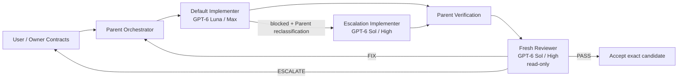

<p align="center">
  <strong>日本語</strong> · <a href="README.md"><strong>English</strong></a>
</p>

<div align="center">

# MandateMarshal

### Agentには自律性を。決定権まで渡さない。

**CodexとCoding Agentのための、権限境界を持つオーケストレーション基盤。**<br>
実装は任せる。判断責任は分ける。最終候補は別コンテキストで監査する。

[](https://github.com/Soph1yzzz/mandatemarshal/actions/workflows/ci.yml)
[](https://github.com/Soph1yzzz/mandatemarshal/releases/latest)
[](LICENSE)
[](docs/CODEX_SETUP.md)
[](tsconfig.json)

[クイックスタート](#クイックスタート) · [なぜ必要か](#なぜmandatemarshalが必要か) · [Codexでの使い方](#codexでの使い方) · [Architecture](docs/ARCHITECTURE.md) · [Security](SECURITY.md)


</div>

MandateMarshalは、**「作業してよい」と「決めてよい」を分ける**ためのオーケストレーション基盤です。

Coding Agentには、仕様が固まった範囲ならできるだけ自律的に動いてもらう。一方で、方針変更や恒久ルール、例外の承認まで実装側の判断で進めさせない。この境界を、役割・状態・証拠・レビューの仕組みとして固定します。

> **Autonomy does not imply authority.**<br>
> 自律的に動けることと、決定権を持つことは別です。

## 30秒で分かるMandateMarshal

| よくあるAgent運用 | MandateMarshalを使う場合 |
| --- | --- |
| 細かい実装判断まで毎回ユーザーへ聞く | ParentがOwner Contractの範囲内で設計と分解を引き受ける |
| 不明点を埋めるために、いつの間にか仕様や恒久ルールを変える | `DETECT -> INVESTIGATE -> PROPOSE -> HOLD -> ESCALATE` で決定権の境界を守る |
| Reviewerが「自分ならこう設計する」を始める | Fresh ReviewerはQA専任。判定は `PASS | FIX | ESCALATE` のみ |
| 指定モデルが使えず、別モデルへ黙って切り替わる | exact routeを要求し、満たせなければ明示的に失敗する |
| PASS後にコードが変わっても、そのまま完成扱いする | PASSを候補IDへ束縛し、変更された時点で失効させる |
| 子Agentが「テストしました」と言えば検証済みになる | コマンド、Git状態、path、artifactなど機械で取れる証拠は機械で確認する |
| 親プロセスが落ちると、子Agentを再実行してよいか分からない | intent / observationを残し、重複実行を避けながら復旧する |

MandateMarshalが狙っているのは、Agentを細かく縛ることではありません。**任せてよい範囲を広くしつつ、越えてはいけない決定権だけを明確にすること**です。

## なぜMandateMarshalが必要か

強いCoding Agentを使うと、運用は大きく二つの失敗に寄りやすくなります。

一つは、何でもユーザーに確認することです。変数名や実装順序まで質問されると、Agentを使う意味が薄れます。

もう一つは、その反対です。Agentが作業を終わらせるために、曖昧な部分を自分で補い、仕様・インターフェース・恒久ルールまで書き換えてしまう。こちらは速く見えるぶん、後から効いてきます。

MandateMarshalでは、Owner、Parent、Implementer、Fresh Reviewerの責任を分けます。

```text
User / Owner
    ^  Ownerだけが決める事項
    |
Parent Orchestrator ----> Implementer
    |                        |
    +---- Evidence/State <---+
    |
    +----> Fresh Reviewer (read-only QA)
```

実装中のローカル判断はParentが引き受けます。Owner Contractと衝突する可能性が出たときだけ、その範囲を止めてユーザーへ戻します。

Fresh Reviewerは別の設計者ではありません。最終候補を新しいコンテキストで読み、品質・回帰・実行契約の問題だけを確認します。修正そのものは行いません。

## 実運用でFresh Reviewerが拾ったもの

下流プロジェクトでのdogfoodingでは、Parent側の重点検証を通過した候補から、fresh read-only reviewerが**本番経路だけで発生するnamespace境界のバグ**を見つけました。

Reviewerは`FIX`を返し、修正後の新しい候補を改めてレビュー。その候補だけが後段のsmokeへ進みました。

これは「Fresh Reviewerなら必ずバグを見つける」という話ではありません。実装と最終受け入れが同じコンテキスト・同じ思考の流れだけで完結しないことに、実際の価値があったという実例です。

## クイックスタート

### ソースから確認する

```bash
git clone https://github.com/Soph1yzzz/mandatemarshal.git
cd mandatemarshal
bun install --frozen-lockfile
bun run check
```

### Codexへ導入する

初回だけCLIを用意し、公開済みreleaseへpinしたうえで対象projectを有効化します。

```bash
bun link
mandatemarshal pin latest
mandatemarshal activation enable /path/to/your-project
```

再現性を優先する場合はversionを固定します。

```bash
mandatemarshal pin 0.2.9
mandatemarshal pin status
mandatemarshal version
```

`mandatemarshal version`では、runtime、pin、installed plugin、version固定されたplugin cache、Skill、authority profileの整合状態をまとめて確認できます。

pin後はCodexを再起動し、最初の一度だけ明示的に呼び出します。

```text
Use MandateMarshal for this project.
```

projectをactivationすると、その後は同じproject内で毎回名前を呼ばなくても継続できます。

## どう動くか



候補がレビュー後に1文字でも変われば、古い`PASS`はその候補には使えません。修正後は新しい候補として、もう一度Fresh Reviewerを通します。

## 役割

| Role | 担当 | やってはいけないこと |
| --- | --- | --- |
| User / Owner | 目的、Owner Contract、例外、恒久的・不可逆性の高い判断 | 細かい実装判断まで強制的に引き取ること |
| Parent Orchestrator | 設計、分解、routing、検証、review対応、最終受け入れ | Owner Contractを黙って変更すること |
| Routine Implementer | 固まった範囲の実装 | architectureの作り直し、勝手なlane昇格、無断commit/tag/push |
| Complex Implementer | Lunaが具体的にblockedした後の明示的なSol escalation | 難しそうという予測だけで自己昇格すること、Owner policyまで変更すること |
| Fresh Reviewer | read-onlyのQA、code review、execution contract確認 | 自分で修正すること、repositoryを変更すること、第二のarchitectになること |

Reviewerの判定は次の3つだけです。

```text
PASS | FIX | ESCALATE
```

`rethink`のような「設計から考え直せ」という権限はReviewerに持たせません。

## Ownerと衝突したとき

ParentがOwner Contractとの衝突を検出した場合は、次の順で処理します。

```text
DETECT -> INVESTIGATE -> PROPOSE -> HOLD -> ESCALATE
```

`HOLD`するのは問題のある操作だけです。分からないことがあるからといって、project全体へ恒久的な禁止ルールを追加しません。

## Codexでの使い方

v0.3.0では、Codex routingを**GPT-6 Luna + GPT-6 Solの2モデル**へ整理しています。

| Semantic role | Codex model | Reasoning effort |
| --- | --- | --- |
| Parent | `gpt-6-sol` | `high` |
| `fresh-reviewer` | `gpt-6-sol` | `high` |
| `routine-implementer` | `gpt-6-luna` | `max` |
| `complex-implementer` | `gpt-6-sol` | `high` |

Parentはユーザーが操作しているroot session、Fresh Reviewerはfresh contextかつread-onlyです。同じSol / Highでも役割とコンテキストは分離します。

実装は必ずLuna / Maxから始めます。最初から「複雑そうだからSol」は選びません。Lunaが実際に具体的なblockerを返した場合だけ、Parentが理由付きで`routine-implementer -> complex-implementer`を明示的にreclassificationし、Sol / Highへ上げます。

Luna自体を起動できない場合はcapability errorです。これはSolへ切り替える理由にはなりません。Astra、Terra、GPT-5.6、旧`sol-high-compat`はv0.3.0のactive routingから外れています。

## Pin時にSkillとauthority profileを照合する

`mandatemarshal pin`はCodexのnative plugin marketplaceを使いますが、install済みと表示されたことだけでは成功扱いにしません。

v0.2.8以降は、公開releaseのtagを基準に次を照合します。

```text
published release tag
        ↓
plugin manifest
canonical Skill
release-appropriate agent profiles
        ↓ hash verification
exact versioned plugin cache
        ↓
~/.mandatemarshal/pin.json
```

runtime Skillの正本として認めるのは、次のversion固定cacheだけです。

```text
~/.codex/plugins/cache/mandatemarshal/mandatemarshal/<version>
```

別のcacheや古いglobal Skillを探して代用することはしません。cacheが欠けている、古い、改変されている場合はpinを失敗させます。

さらに、authority profile群をまとめたSHA-256をpin recordへ保存します。pin後にTOMLだけ差し替えられても、`pin status`で`DRIFTED`として検出できます。

## Agent profileを手動配置する場合

plugin marketplaceを使わない場合は、projectの`.codex/agents`へprofileを配置できます。

```bash
bun run install:codex-agents -- /path/to/target/.codex/agents
```

生成される主なprofileは次の通りです。

- Routine Implementer: GPT-6 Luna / Max / `workspace-write`
- Complex Implementer: GPT-6 Sol / High / `workspace-write`（Lunaがblockedした後の明示的escalationのみ）
- Fresh Reviewer: GPT-6 Sol / High / `read-only`

installerが配置するactive profileはこの3つだけです。Astra、Terra、GPT-5.6、旧compatibility profileはv0.3.0のinstall対象に含めません。

既存profileは勝手に上書きしません。必要な場合だけ`--force`を明示します。

## Skillの正本は1つだけ

repositoryにはplugin packageと移行用pathがありますが、runtime Skillの正本は一つです。

```text
.agents/plugins/marketplace.json
.codex-plugin/plugin.json
plugins/mandatemarshal-runtime/.codex-plugin/plugin.json
plugins/mandatemarshal-runtime/skills/mandatemarshal/   # v0.3+ runtime Skillの正本
plugins/mandatemarshal-runtime/agents/                  # active profile 3個だけ
skills/orchestration/SKILL.md                   # migration pointerのみ
```

v0.3+では`plugins/mandatemarshal-runtime/`だけをMarketplaceとpackageの正本にします。`skills/orchestration/`と旧`plugins/mandatemarshal/`側のSkill entryにはfrontmatterを置かず、古いリンクと履歴を残すための案内に限定します。これにより、旧Astra/5.6 profileをrepo上の履歴として残してもv0.3のinstall/cache surfaceには入りません。

## Project activation

MandateMarshalは**explicit-first, project-persistent**です。

未登録projectへ勝手に発火しません。最初の一度はユーザーが明示的に選び、その後だけ同じprojectで継続します。

```bash
mandatemarshal activation enable /path/to/project
mandatemarshal activation status /path/to/project
mandatemarshal activation disable /path/to/project
```

activation stateはproject外へ保存します。

```text
~/.mandatemarshal/projects/<project-id>.json
```

そのため、MandateMarshalを有効化しただけで対象repositoryがdirtyになることはありません。

## Run receiptとauthorityの照合

通常のSkill経由でも、FIX/PASS loopをまたいで同じrunを追えるよう、軽量なreceiptを持ちます。v0.2.9では、このreceiptで「今どの操作が許可されているか」まで機械的に追えるようになりました。

```bash
mandatemarshal run ensure /path/to/project
mandatemarshal run advance <run-id> parent-verified
mandatemarshal run advance <run-id> reviewer-started --thread <reviewer-handle> --review-kind release-readiness
mandatemarshal run advance <run-id> review-verdict --verdict PASS --grant staging-deploy --grant production-deploy
mandatemarshal run authority <run-id>
mandatemarshal run reconcile <run-id> --ref refs/tags/v0.2.9
mandatemarshal run consume <run-id> --scope staging-deploy
mandatemarshal run revoke <run-id> --scope production-deploy
```

`review-kind`とgrant名はproject側で決める短いslugです。MandateMarshal本体は`deploy`や`publish`、`smoke`といった言葉の意味を決めません。grantの状態は`current / historical / consumed / revoked`の4つです。candidateが変わったりruntimeが更新されたりすると、まだ有効だったgrantは自動で`historical`になります。同じscopeへ新しいPASSが出た場合も、古いgrantだけが履歴へ移ります。

`run reconcile`はREADMEやhandoff文書を信用して現在地を決めるコマンドではありません。repositoryをもう一度観測し、candidateとGit HEADを取り直します。必要なら`refs/tags/...`のような完全修飾refも照合できます。ただしtagが存在するだけで権限が生えることはありません。人間向け文書と機械状態が食い違った場合は、receiptと現在のrepository観測が正本です。

永続receiptは次に保存されます。

```text
~/.mandatemarshal/receipts/
```

保存するのは、project identity、現在候補、Git HEAD、Parent verification、review binding、grantの状態など、再開と権限確認に必要な小さい情報だけです。

Git repositoryではcandidate identityにHEAD、porcelain state、HEAD相対binary diff、Gitが列挙したnon-ignored untracked bytesを使います。巨大なignored artifact treeや変更されていないtracked fileを毎回読み直しません。

詳細traceはOSのtemp領域へ置き、30日TTLで扱います。traceが消えてもpersistent receiptは消えません。

詳しくは[Run Receipts](docs/RUN_RECEIPTS.md)を参照してください。

## Crash recovery

Durable modeでは、外部操作を始める前にintentを記録し、crash後は観測できる状態から続きを判断します。

復旧時は「ローカルに完了記録がない」だけを理由に同じ子Agentをもう一度起動しません。

```text
completed                -> 既存結果を再利用
not-found authoritative  -> 安全な境界でretry可能
still running            -> 待機
ambiguous                -> reconciliation-requiredで停止
```

一つのrunを複数Parentが同時に進めないよう、heartbeat付きのsingle-writer leaseも持ちます。

Codexのdurable operationではthread IDをrepository外へ保存し、完了済みsession JSONLを再利用できます。不完全なsessionは、副作用の安全性を証明できない限り自動resumeしません。

```bash
mandatemarshal run status <run-id>
mandatemarshal run resume <run-id>
```

詳細は[Durable Runtime](docs/DURABLE_RUNTIME.md)を参照してください。

## 完了条件

MandateMarshalが適合済みの完了として扱えるのは、少なくとも次を満たしたときだけです。

1. Owner Contractの範囲で依頼が解決している
2. implementation packetが揃っている
3. Parentが実際の最終候補を確認している
4. 必須のdeterministic verificationと証拠がある
5. **新しいFresh Reviewer**が現在候補へ`PASS`を返している
6. review中・review後にcandidate identityが変わっていない
7. 未解決のescalationやOwner decisionが残っていない

`FIX`が出れば旧reviewは失効します。候補が変われば旧`PASS`も失効します。

## 機械で確認できる証拠

機械で確認できる事実は、できるだけモデルの自己申告にしません。

現在のevidence機構では、たとえば次を扱えます。

- 実行command ledger
- 必須・禁止command
- `python -B`のような必須flag
- Git / non-Git candidate identity
- repositoryのbefore / after state
- diff
- 許可path / 禁止path
- forbidden artifact scan
- 外部run artifact

persistent run evidenceは既定でrepository外に保存します。

```text
~/.mandatemarshal/runs/<run-id>/
```

Agentを使っただけでprojectへ監査ファイルを撒かないためです。

## コード構成

```text
src/
  core/             # provider-neutral contract / authority / state machine
  orchestrator/     # routingとPASS/FIX/ESCALATE loop
  runtime/          # deterministic evidence / persistence / recovery
  adapters/
    codex/           # Codex mapping + CLI driver
    claude-code/     # experimental portability bridge
    generic/         # mock / conformance adapter
```

`src/core/**`へprovider名やmodel名を持ち込まないことはtestで固定しています。

## 設定

`config.example.json`が現在の設定例です。

MandateMarshal準拠のrunで固定される主な条件は次の通りです。

- Fresh Reviewer必須
- Fresh Reviewerはfresh context
- verdictは`PASS | FIX | ESCALATE`のみ
- Reviewerは自分でFIXしない
- model / role / effortを黙ってfallbackしない
- review後にcandidateが変わったらPASS失効
- Owner Contractを暗黙変更しない

`python -B`のようなproject固有policyはMandateMarshal全体の法律にせず、必要なrepositoryだけ設定します。

## テスト

現在のsuiteでは、authority、state machine、execution evidence、routing、durable crash recovery、Codex adapter、provider-neutral core、Claude portability fixtureなどを検証しています。

特に、次のような回帰を固定しています。

- 不明点から恒久ルールを勝手に作れない
- fresh `PASS`なしで完了できない
- candidate変更後に古いreviewを再利用できない
- Reviewerがrepositoryを変更したら完了できない
- `rethink` verdictはschema違反
- 指定model / effortが使えなくても別routeへ黙ってfallbackしない
- crashed Implementer / Reviewerを曖昧なまま二重起動しない
- 完了済みdurable operationは子Agentを再起動せず回収する
- live lease中に別Parentがrunを奪えない

```bash
bun test
```

## セキュリティモデル

MandateMarshalでは、一般的な脆弱性だけでなく、**権限や能力を実際より強く見せること**もsecurity issueとして扱います。

主に想定している脅威は次の通りです。

- capability spoofing
- silent fallback
- reviewer mutation
- repository内テキストからのprompt injection
- fabricated evidence
- authority laundering
- 終わらないperfection loop
- 不確実性を理由にした恒久policy変更

requested capabilityとobserved capabilityは分けて記録します。たとえば`read-only`を要求できたことと、外部から「本当に一切書かなかった」と独立証明できたことは同じ扱いにしません。

詳しくは[SECURITY.md](SECURITY.md)を参照してください。

## 現在の制限

- Claude Codeはexperimental bridge / conformance fixtureで、production parityではありません。
- 一部hostではSkill読込判定がMandateMarshalのactivation registry参照より先に行われるため、新しいhost contextでの自動再発見を完全には保証できません。
- provider sessionをresumeできることと、副作用を安全に再試行できることは別です。曖昧な外部操作はfail-closedします。
- 0.x系では、互換性を保った実運用hardeningと大きなarchitecture変更をversion lineで分けています。

## 開発

```bash
bun install --frozen-lockfile
bun run typecheck
bun test
bun run validate:config
bun run scan:artifacts
```

現在の`0.2.x`は、dogfoodingで見つかったtraceability、packaging、recovery、routingの改善を積む安定化lineです。worktree-per-run、semantic checkpoint、candidate lineageといった大きな変更は`0.3.0`で扱う予定です。

## Provenance

設計仕様は**Sol Advisor**（MIT）の考え方、特にarchitect-first orchestration、bounded implementation packet、fresh review、adapter分離から影響を受けています。

MandateMarshal v0.1のsourceは、渡された仕様をもとに独立実装したもので、Sol Advisorのsource codeをコピーしたものではありません。今後upstream codeを取り込む場合は、対象revisionとderived fileを`THIRD_PARTY_NOTICES.md`へ記録し、MIT noticeを保持します。

## License

MIT License。詳細は[LICENSE](LICENSE)を参照してください。

---

**MandateMarshal：実装は任せる。決定権は分ける。**
