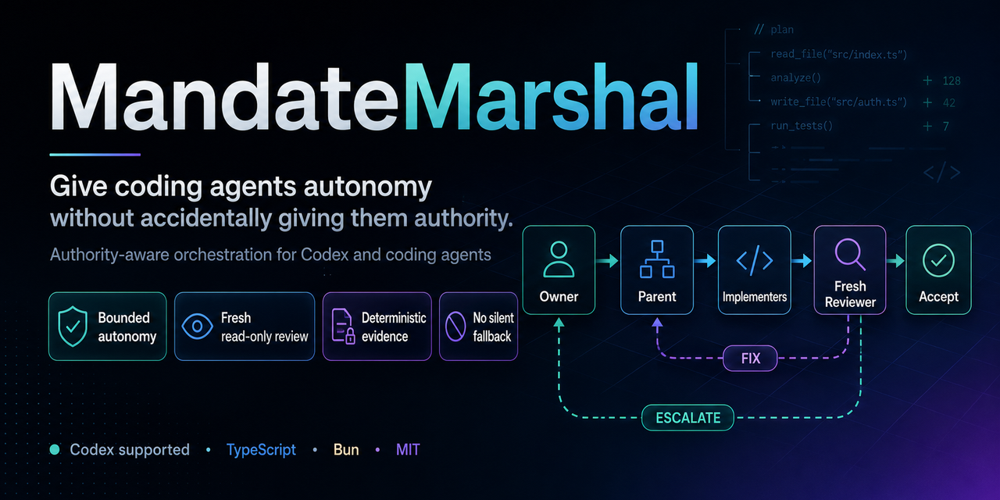
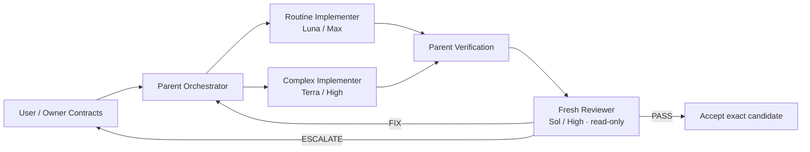

<div align="center">

# MandateMarshal

### Give coding agents autonomy without accidentally giving them authority.

**Authority-aware orchestration for Codex and coding agents.**<br>
Bounded implementation. Fresh read-only review. Durable recovery. Deterministic evidence. No silent fallback.

[](https://github.com/Soph1yzzz/mandatemarshal/actions/workflows/ci.yml)
[](https://github.com/Soph1yzzz/mandatemarshal/releases/latest)
[](LICENSE)
[](docs/CODEX_SETUP.md)
[](tsconfig.json)

[Quick start](#quick-start) · [Why it exists](#why-mandatemarshal-exists) · [Durable runtime](docs/DURABLE_RUNTIME.md) · [Codex setup](docs/CODEX_SETUP.md) · [Architecture](docs/ARCHITECTURE.md) · [Security](SECURITY.md)



</div>

MandateMarshal separates **who may execute** from **who may decide**. Give coding agents room to work inside settled boundaries without letting implementation uncertainty silently become project policy.

## In 30 seconds

| Without MandateMarshal | With MandateMarshal |
| --- | --- |
| The agent asks you about every local implementation choice | Parent owns architecture and decomposition inside your Owner Contracts |
| Uncertainty silently turns into a new permanent rule | `DETECT -> INVESTIGATE -> PROPOSE -> HOLD -> ESCALATE` |
| A reviewer drifts into becoming a second architect | Fresh Reviewer is QA-only: `PASS | FIX | ESCALATE` |
| A requested model/role is unavailable and something else runs | Exact route or loud capability failure; no silent fallback |
| Review passes, then the candidate changes | The old `PASS` is invalid because review is bound to candidate identity |
| A child claims verification happened | Deterministic evidence captures commands, repository state, paths, and artifacts |
| The orchestrator crashes after launching a child | Durable intent/observation records prevent blind duplicate launches and recover proven completed work |

The core rule is simple:

> **Autonomy does not imply authority.**

## Quick start

### Verify from source

```bash
git clone https://github.com/Soph1yzzz/mandatemarshal.git
cd mandatemarshal
bun install --frozen-lockfile
bun run check
```

### Prepare a Codex project

Bootstrap the CLI once, pin the Codex integration to a released version, then explicitly activate the target project:

```bash
bun link
mandatemarshal pin latest
mandatemarshal activation enable /path/to/your-project
```

Use an exact release when you want reproducibility:

```bash
mandatemarshal pin 0.2.3
mandatemarshal pin status
mandatemarshal version
```

`mandatemarshal version` prints the runtime version plus the pinned, installed-plugin, and legacy-Skill versions in one view. `mandatemarshal --version` and `mandatemarshal -v` print only the runtime version for scripts.

`pin` uses Codex's native plugin marketplace and keeps the plugin metadata, Skill, agent profiles, and delegated MandateMarshal CLI on the same released Git tag. For compatibility with older installs, it also mirrors the pinned Skill/agents into the legacy `~/.codex/skills/mandatemarshal` and `~/.codex/agents/mandatemarshal_*.toml` locations so stale manual copies cannot win discovery. After pinning or changing versions, start a new Codex session. Once that bundled Skill is loaded, say:

```text
Use MandateMarshal for this project.
```

The first use is explicit. After activation, MandateMarshal can continue for later work in the same project without making you repeat its name on every request. See [Codex setup](docs/CODEX_SETUP.md) for plugin/Skill packaging, exact model mappings, and the host-discovery caveat.

## How it works



The model names above are the **Codex adapter defaults**, not assumptions in the provider-neutral core. A candidate that changes after review loses its `PASS` and must be reviewed again.

## Why MandateMarshal exists

Powerful coding agents fail in two opposite ways:

- **Micromanagement:** they ask the user about every local implementation choice.
- **Authority overreach:** they encounter uncertainty and silently rewrite project policy, interfaces, or permanent constraints in order to finish.

Fresh reviewers create another failure mode when they drift from QA into becoming a second architect.

MandateMarshal encodes a different hierarchy:

```text
User / Owner
    ^ owner-level decisions only
    |
Parent Orchestrator ----> Implementer
    |                        |
    +---- Evidence/State <---+
    |
    +----> Fresh Reviewer (read-only QA)
```

That hierarchy is the concrete expression of the rule above: implementation authority stays bounded by Owner authority.

## Role model

| Role | Owns | Must not do |
| --- | --- | --- |
| User / Owner | Project-level goals, Owner Contracts, exceptions, permanent and materially irreversible decisions | Be forced to decide routine implementation detail |
| Parent Orchestrator | Architecture, decomposition, semantic routing, verification, review handling, final acceptance | Silently mutate Owner Contracts |
| Routine Implementer | Bounded implementation inside a settled packet | Redesign architecture or self-promote lanes |
| Complex Implementer | Higher-context bounded implementation | Treat complexity as permission to change Owner policy |
| Fresh Reviewer | Read-only QA/code/execution-contract findings | Implement fixes or act as a second architect |

Reviewer verdicts are exactly:

```text
PASS | FIX | ESCALATE
```

There is no reviewer `rethink` authority.

## Owner conflict protocol

When a request conflicts with an Owner Contract, Parent follows:

```text
DETECT -> INVESTIGATE -> PROPOSE -> HOLD -> ESCALATE
```

`HOLD` applies only to the affected action. Uncertainty must not create a permanent prohibition.

## Codex support

MandateMarshal is packaged for Codex and uses Codex custom-agent, model/effort routing, sandbox, Plugin, and Skill surfaces. Real-host acceptance smoke has executed the complete routine, complex, and Fresh Reviewer lanes successfully on Codex. v0.2 additionally runs a real Luna/Max durable-session smoke that persists the Codex thread ID and recovers the completed operation through the durable observer.

## Codex defaults

These are adapter defaults, not core assumptions:

| Semantic role | Default Codex model | Effort |
| --- | --- | --- |
| `routine-implementer` | `gpt-5.6-luna` | `max` |
| `complex-implementer` | `gpt-5.6-terra` | `high` |
| `fresh-reviewer` | `gpt-5.6-sol` | `high` |
| Parent | inherit | inherit |

A settled bounded packet routes routine-first. Material complexity can be explicitly reclassified to complex with a `LaneReclassified` event. Failure to launch Luna/Max is **not** a reason to silently use Terra/High.

Current Codex agent configuration supports project-scoped custom agents, per-agent model/reasoning configuration, and read-only sandbox requests. MandateMarshal records requested and observed capability separately rather than claiming requested isolation was enforced.

## Deterministic evidence

MandateMarshal uses machines for mechanical facts and model judgment for contextual review.

Built-in evidence primitives cover:

- exact command ledger ingestion;
- required/forbidden command checks;
- required flag checks such as a repository-specific `python -B` policy;
- Git/non-Git candidate identity;
- before/after repository state;
- diff capture;
- allowed/forbidden write-path checks;
- configurable forbidden-artifact scans;
- external run-artifact persistence.

By default persistent run evidence is written under:

```text
~/.mandatemarshal/runs/<run-id>/
```

so the target repository is not dirtied merely by being orchestrated.

## Durable crash recovery — v0.2

Durability can be enabled per orchestration run. The runtime persists an append-only journal and snapshots outside the target repository:

```text
~/.mandatemarshal/runtime/<run-id>/
```

Important external operations are recorded as an intent before execution and reconciled from observed state after a crash. Recovery distinguishes:

- completed work that can be reused;
- authoritative non-execution that permits retry;
- work that is still running;
- ambiguous work that must stop as `reconciliation-required` rather than risk a duplicate side effect.

A single-writer lease with heartbeat prevents two Parent runtimes from advancing the same durable run concurrently.

For Codex durable operations, MandateMarshal records the persistent Codex thread ID under `~/.mandatemarshal/providers/codex/operations/`. Completed session JSONL can be recovered without relaunching the child. Incomplete Codex sessions are deliberately **not** auto-resumed when side-effect safety cannot be proven.

Operator inspection:

```bash
mandatemarshal run status <run-id>
mandatemarshal run resume <run-id>
```

See [Durable Runtime](docs/DURABLE_RUNTIME.md) for recovery semantics, fault-injection coverage, and deliberate v0.2 limits.

## Fresh-review gate

A run may report compliant completion only when:

1. the current request is resolved under active Owner Contracts;
2. the implementation packet is complete;
3. Parent inspected the actual candidate;
4. required deterministic verification/evidence is available;
5. a **new fresh reviewer** returned `PASS` for the exact current candidate;
6. candidate identity did not change during or after review;
7. no escalation or Owner decision remains pending.

Any `FIX` invalidates the previous review. Any candidate mutation invalidates the previous `PASS`.

## Install from source

Requirements:

- Bun 1.3+
- Node.js 22+ for compatible tooling
- Codex CLI only when using the real Codex CLI driver
- access to the exact configured models/effort levels when using those mappings

```bash
bun install --frozen-lockfile
bun run check
bun run validate:config
```

### Preferred Codex install/update: pin a release

After the one-time CLI bootstrap, update Codex with one command:

```bash
mandatemarshal pin latest
```

Or pin an exact release:

```bash
mandatemarshal pin 0.2.3
mandatemarshal pin status
mandatemarshal version
```

`mandatemarshal version` is the quick human check: it reports the active runtime version, exact pin, installed Codex plugin version, legacy Skill version, and an `OK`/drift status. `--version`/`-v` emit only the runtime version.

The selected Git tag is installed through Codex's native plugin marketplace. MandateMarshal records the exact pin under `~/.mandatemarshal/pin.json`, mirrors the pinned Skill/agents into the legacy global MandateMarshal paths for backward-compatible discovery, and delegates normal CLI commands to the CLI source from that pinned marketplace checkout. This prevents version skew between the Skill/plugin metadata and the runtime implementation.

Start a new Codex session after changing the pin.

### Manual fallback: project-scoped Codex agent profiles

If you intentionally do not use the plugin marketplace, run MandateMarshal's legacy installer with the target `.codex/agents` directory:

```bash
bun run install:codex-agents -- /path/to/target/.codex/agents
```

The installer refuses to overwrite existing agent profiles unless `--force` is explicitly supplied after review.

The generated profiles request:

- Luna/Max + `workspace-write` for routine implementation;
- Terra/High + `workspace-write` for complex implementation;
- Sol/High + `read-only` for Fresh Reviewer.

See `docs/CODEX_SETUP.md`.

## Plugin / Skill packaging

The repository includes both the source packaging and a Codex marketplace package:

```text
.agents/plugins/marketplace.json
.codex-plugin/plugin.json
plugins/mandatemarshal/.codex-plugin/plugin.json
plugins/mandatemarshal/skills/mandatemarshal/
plugins/mandatemarshal/agents/
skills/orchestration/SKILL.md
skills/orchestration/references/
```

MandateMarshal uses **explicit-first, project-persistent activation**. An unregistered project does not activate automatically. The first use requires an explicit user selection; after that, the same project can continue under MandateMarshal without repeating the brand on every request until explicitly disabled.

Persistent activation is stored outside the target repository:

```text
~/.mandatemarshal/projects/<project-id>.json
```

so activation itself does not dirty the project.

CLI controls:

```bash
mandatemarshal activation enable /path/to/project
mandatemarshal activation status /path/to/project
mandatemarshal activation disable /path/to/project
```

v0.1 project identity is based on the canonical project path. Moving or renaming a project may therefore require explicit activation again.

**Host limitation:** some Codex/agent hosts decide whether to load a Skill before MandateMarshal code can inspect this external registry. In those environments, a brand-new host context cannot yet be guaranteed to rediscover activation automatically; current-context continuation is the v0.1 fallback. MandateMarshal does not use that limitation as an excuse to auto-activate unrelated projects.

## Library architecture

```text
src/
  core/             # provider-neutral contracts, authority, state machine
  orchestrator/     # routing and PASS/FIX/ESCALATE loops
  runtime/          # deterministic evidence and persistence
  adapters/
    codex/           # Codex mapping + CLI driver
    claude-code/     # v0.1 experimental portability bridge
    generic/         # mock/conformance adapter
```

Provider/model branding is forbidden from `src/core/**` and enforced by the test suite.

### Core API sketch

```ts
import {
  CodexAdapter,
  CodexCliDriver,
  OrchestrationEngine,
  computeRepositoryCandidateId,
} from "mandatemarshal";

const driver = new CodexCliDriver({ cwd: process.cwd() });
const adapter = new CodexAdapter(driver);

// ParentController is application/host supplied because Owner-contract and
// architecture judgment must not be silently hardcoded into the transport.
const engine = new OrchestrationEngine(adapter, parentController);
const result = await engine.run(userRequest);
```

See `docs/ARCHITECTURE.md` for the contract boundaries.

## Configuration

`config.example.json` demonstrates the current v1 configuration schema. Hard invariants for a compliant run include:

- mandatory fresh review;
- fresh reviewer context required;
- `PASS | FIX | ESCALATE` only;
- reviewer never self-fixes;
- no silent model/role/effort fallback;
- post-review mutation invalidates `PASS`;
- Owner Contracts cannot be silently changed.

Repository-specific policies such as Python no-bytecode remain opt-in configuration, not global MandateMarshal law.

## Tests

The current suite covers authority, state, execution evidence, routing, durable crash recovery, Codex adapter conformance, provider-neutral core, and Claude portability fixtures.

Important regressions include:

- uncertainty cannot become silent permanent disablement;
- fresh `PASS` is mandatory and candidate-bound;
- stale review cannot authorize a mutated candidate;
- reviewer mutation blocks completion;
- reviewer `rethink` is schema-invalid;
- missing `python -B` is detected when configured;
- forbidden `.pyc` is detected mechanically;
- unowned writes are rejected;
- routine routes to Luna/Max;
- material complexity routes/reclassifies to Terra/High;
- unavailable exact effort/model selection does not silently fall back;
- a mock Claude Code bridge runs the same provider-neutral orchestration path;
- journal sequence corruption fails closed;
- an ambiguous crashed Implementer or Fresh Reviewer launch is not duplicated;
- an authoritatively absent operation can be retried once;
- a proven completed Codex durable operation is recovered without relaunching the child;
- Parent verification can safely retry after crash because that boundary is explicitly idempotent;
- a completed artifact bundle can be reconciled after a crash before the completion event was journaled;
- a live run lease heartbeat prevents stale-owner takeover.

Run:

```bash
bun test
```

## Claude Code status

Claude Code remains an **experimental bridge contract and conformance fixture**, not production parity. A real production-grade Claude Code adapter is planned after the provider-neutral seam has been validated in practice.

MandateMarshal deliberately does not market fixture-level portability as full runtime support.

## Security model

MandateMarshal is an orchestration layer, so security includes truthful reporting of authority and capability—not only conventional code vulnerabilities.

Threats explicitly considered include:

- capability spoofing;
- silent fallback;
- reviewer mutation;
- prompt injection through repository content;
- fabricated evidence;
- authority laundering;
- infinite perfection loops;
- permanent policy mutation under uncertainty.

See `SECURITY.md`.

## Upstream / provenance

The design specification was influenced by ideas in **Sol Advisor** (MIT), especially architect-first orchestration, bounded implementation packets, fresh review, and adapter direction.

MandateMarshal v0.1 source code in this repository was implemented independently from the supplied specification rather than copied from Sol Advisor source. If future versions import substantial upstream code, `THIRD_PARTY_NOTICES.md` must be updated with the exact upstream revision and derived files while preserving MIT notices.

## License

MIT. See `LICENSE`.

---

**MandateMarshal:** autonomy for implementation, explicit ownership for decisions.
